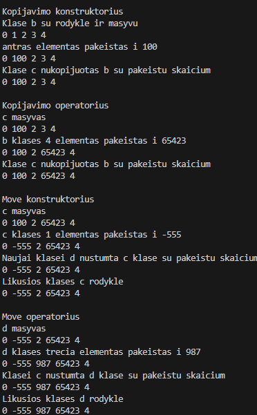
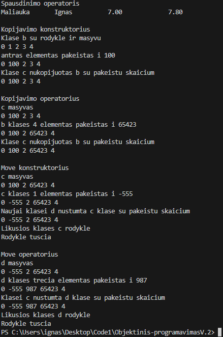

# V1.5 Versija
## Kas nauja 1.5 versjoje
1. Klase atskirta i dvi
2. sukurtas papildomas failas perkelt funkciju definitions
3. Bazine klase padaryta abstrakcia

## Bazine klase

## Derrived klase

## Bazine klase yra abstrakti

Bazines klases negalima kurti, kadangi joje yra naudojama gryna virtuali funkcija

## testavimas pries sutvarkant klases

Matosi, kad neteisingai, kadangi po move komandos, rodykle nera nullptr. Tai parodo, kad funkcija naudoja default konstruktorius
## testavimas po virtualiu funkciju

Tai parodo, kad derrived klase teisingai naudoja overloadintus konstruktorius ir operatorius