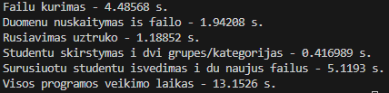
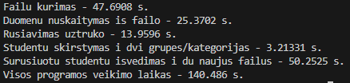

## V1.0 Versija
# Ka si programa sugeba padaryti
1. Programa apdoroja duomenys ir isspausdina studentu rezultatus surusiavus ir apskaiciavus galutini bala.
2. Vartotojas gali ivesti duomenys pats arba pasirinkti, kad duomenys butu automatiskai sugeneruoti.
3. Duomenys galima sugeneruoti i faila, nuskaityti is failo ir irasyti i faila.
4. Studentu duomenys galima suskirstyti i dvi skirtingas grupes, gerus studentus ir blogus studentus.
# Kas nauja 1.0 versjoje
1. Sukurti papildomi failai, kurie realizuoja programos veikima su skirtingais konteineriais.
2. Gauti nauji testavimo laikai.
3. Sutaisyta keleta klaidu ir istrintos nereikalingos kodo vietos.
4. Labiau optimizuotas kodas.

Visi testavimai yra atlikti su failais, kuriuose namu darbu balu kiekis yra 10.

## 1000 dydzio failas
# Vektorius
|Darbas                          |Laikas      |
|--------------------------------|------------|
|Duomenu nuskaitymas is failo    |0.0365163 s.|
|Rusiavimas uztruko              |0.0063748 s.|
|Studentu skirstymas i dvi grupes|0.0037312 s.|
|Visos programos veikimo laikas  |0.1755581 s.|

# studentai10000.txt
|Darbas                          |Laikas      |
|--------------------------------|------------|
|Failu kurimas                   |0.0694658 s.|
|Duomenu nuskaitymas is failo    |0.0365163 s.|
|Rusiavimas uztruko              |0.0063748 s.|
|Studentu skirstymas i dvi grupes|0.0037312 s.|
|Surusiuotu studentu isvedimas   |0.0594699 s.|
|Visos programos veikimo laikas  |0.1755581 s.|

# studentai1000000.txt
|Darbas                          |Laikas      |
|--------------------------------|------------|
|Failu kurimas                   |4.5448 s.   |
|Duomenu nuskaitymas is failo    |1.93674 s.  |
|Rusiavimas uztruko              |1.10117 s.  |
|Studentu skirstymas i dvi grupes|0.347281 s. |
|Surusiuotu studentu isvedimas   |5.10791 s.  |
|Visos programos veikimo laikas  |13.0379 s.  |

