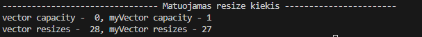

# V3 Versija
## Kas nauja 3 versjoje
1. Sukurta nuosava vektoriaus klase - myVector
2. Patikrintos funkcijos
3. Atlikti testavimai

# Funkciju testavimas

# myVector ir std::vector spartos testavimas

|Elementu kiekis|std::vector|myVector |
|---------------|-----------|---------|
|10000          |0.0001257  |0.0001122|
|100000         |0.0008885  |0.000937 |
|1000000        |0.0077361  |0.0071594|
|10000000       |0.078231   |0.0986152|
|100000000      |0.725096   |0.785338 |
1. myVector veikia greičiau su mažesniais skaičaiais (Vidutiniškai 10% - 15% greičiau)
2. Su dideliais skaičiais myVector veikia lėčiau (Vidutiniškai 5% - 10% lėčiau)

# Resize Kiekis

## Atminties perskirstymas myVector konteineryje yra 1 mažesnins del to, kad default myVector sukuriamas su 1 capacity

# Programos veikimo laikas su konteineriais
## 100.000.txt
|Darbas                 |std::vector|myVector |
|-----------------------|-----------|---------|
|Duomenu nuskaitymas    |0.0001257  |0.0001122|
|skirstymas i dvi grupes|0.0008885  |0.000937 |
|Rusiavimas             |0.0077361  |0.0071594|
|Visas laikas           |0.0077361  |0.0071594|
## 1.000.000.txt
|Darbas                 |std::vector|myVector |
|-----------------------|-----------|---------|
|Duomenu nuskaitymas    |0.0001257  |0.0001122|
|skirstymas i dvi grupes|0.0008885  |0.000937 |
|Rusiavimas             |0.0077361  |0.0071594|
|Visas laikas           |0.0077361  |0.0071594|
## 10.000.000.txt
|Darbas                 |std::vector|myVector |
|-----------------------|-----------|---------|
|Duomenu nuskaitymas    |0.0001257  |0.0001122|
|skirstymas i dvi grupes|0.0008885  |0.000937 |
|Rusiavimas             |0.0077361  |0.0071594|
|Visas laikas           |0.0077361  |0.0071594|