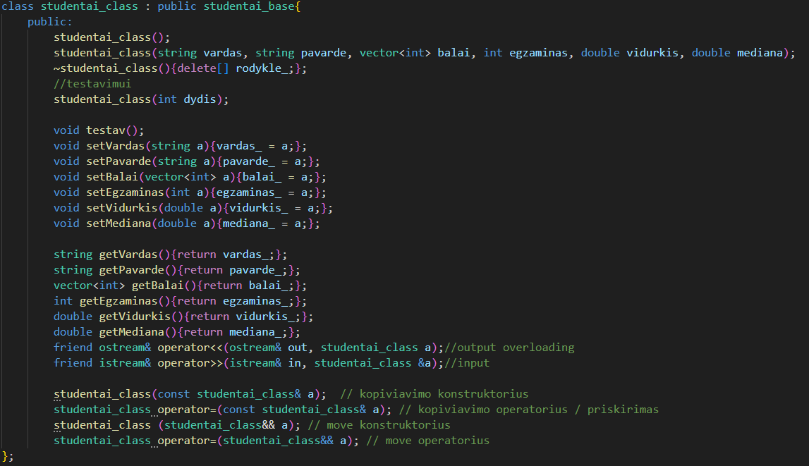
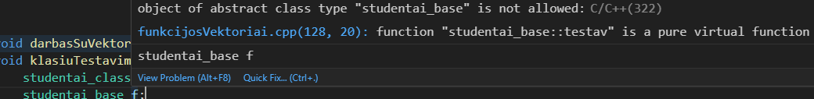
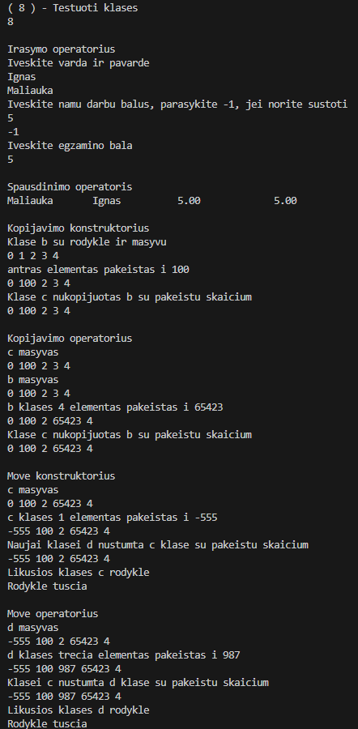

# V1.5 Versija
## Kas nauja 1.5 versjoje
1. Klase atskirta i dvi
2. sukurtas papildomas failas perkelt funkciju definitions
3. Bazine klase padaryta abstrakcia

## Bazine klase

Bazineje klaseje saugomi kintamieji, kurie yra protected, kad juos galetu panaudoti derrived klase ir kelios papildomos funkcijos iskaitant pure virtual function
## Derrived klase

Derrived klaseje yra laikomi get'eriai ir set'eriai, 
## Bazine klase yra abstrakti

Bazines klases negalima kurti, kadangi joje yra naudojama gryna virtuali funkcija, tai pavercia klase i abstrakcia
## testavimas

Tai parodo, kad derrived klase teisingai naudoja overloadintus konstruktorius ir operatorius