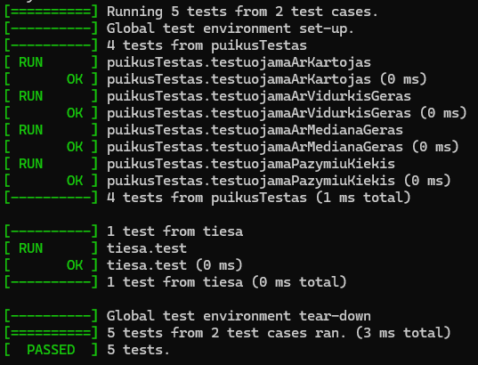
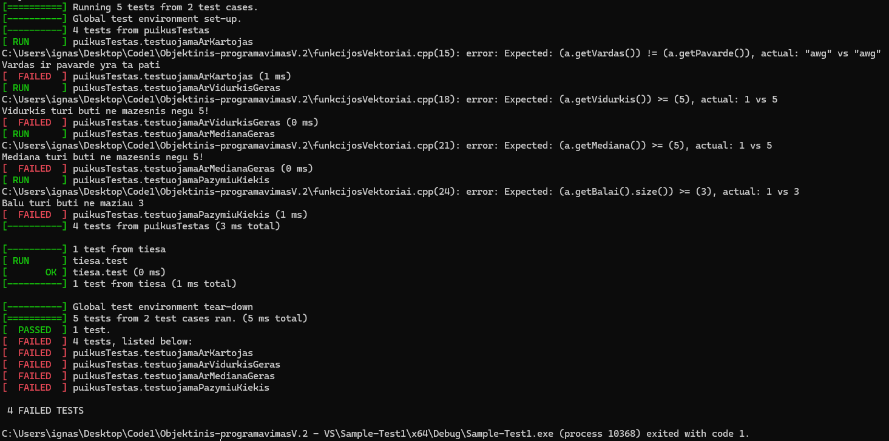
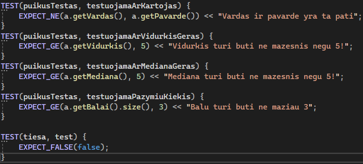
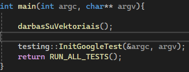
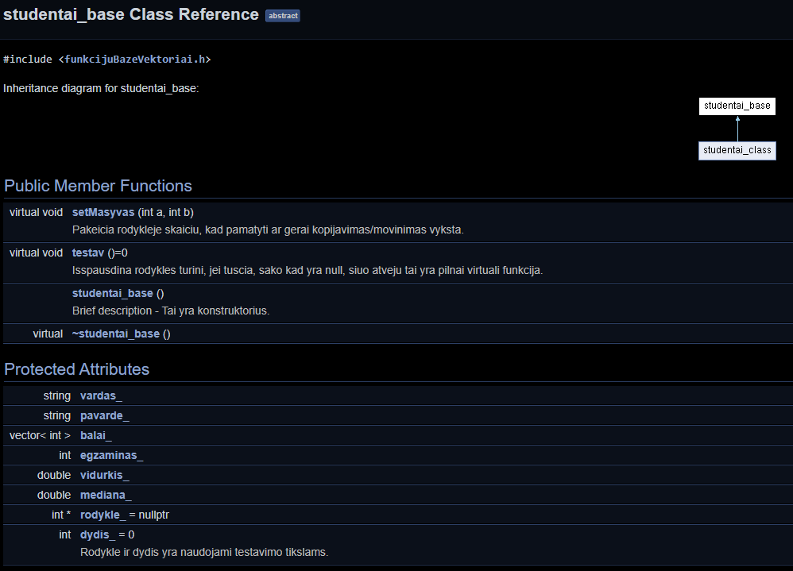

# V2.0 Versija
## Kas nauja 2.0 versjoje
1. Istrinti seni failai skirti darbui su skirtingais konteineriais
2. sukurta Doxygen dokumentacija ir joje aprasytos klases
3. Projektas perkeltas i visual studio
4. Atlikti keli unit testavimai su Google test

# Instaliacija
## 1. Tureti Visual Studio su atsiustais c++ development paketais.
## 2. Atidaryti Sample-Test1.sln projekto faila.
## 3. Atsidariusiame projekte paspausti ant žalios rodyklės (start without debugging).

## Atidaryti Doxygen dokumentacija galima susiradus html aplankale faila index.html

# Nuotraukos

Visi teisingi testai.

Neteisingai atlikti testai.

Test casai ir ka jie daro.

Kaip sie testai yra iskvieciami.

Doxygen dokumentacija. Klasiu kaikurie nariai yra komentuoti

